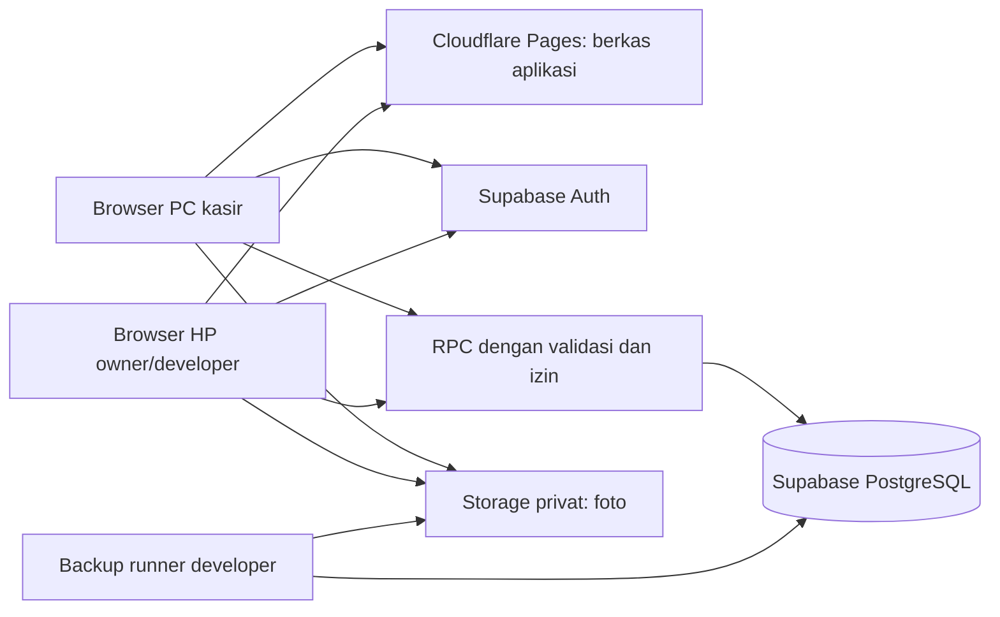

# 04 — Arsitektur, Keamanan dan Kapasitas

Baseline 1.1. Pilihan scope: [keputusan](01-SCOPE-DECISIONS.md). Detail storage/API pada dokumen 05/06. Referensi provider: [sumber](11-SOURCES.md).

## ARC-01 — Komponen

Pages menyajikan build statis. Supabase menyimpan data dan menjalankan fungsi transaksi. React/library UI tidak disimpan sebagai isi database atau dijalankan sebagai server Node permanen di Supabase. Node digunakan untuk tooling lokal/build. Hosting UI tetap dibutuhkan agar HP di luar toko dapat membuka aplikasi.

| Kebutuhan | Pilihan baseline |
|---|---|
| Bahasa/frontend | TypeScript strict, React, Vite, React Router |
| UI | Tailwind dan shadcn yang memang digunakan; Bahasa Indonesia |
| Server state | TanStack Query; cache ringan dan invalidasi eksplisit |
| Form | React Hook Form + Zod; validasi identik secara semantik dengan server |
| Keranjang | Zustand; draf/operation pending disimpan ke IndexedDB melalui Dexie |
| Angka | Decimal.js pada frontend; NUMERIC PostgreSQL; kontrak string desimal |
| Backend data | Supabase Postgres, Auth, RPC; Storage privat |
| Tugas privileged | Script server/local developer atau Edge Function terbatas jika dibutuhkan; bukan secret dalam frontend |
| Testing | Vitest, Playwright, pengujian SQL/RLS dengan PostgreSQL lokal/Supabase local |
| Hosting | Cloudflare Pages Free, domain bawaan; konfigurasi route fallback SPA |
| Schema | Migrasi SQL via Supabase CLI, tipe TS dihasilkan dari schema |

Gunakan versi stabil yang kompatibel saat bootstrap; pin lockfile. Tidak menetapkan angka versi hasil tebakan. Periksa kebutuhan Node CLI pada dokumentasi aktual. Pisahkan environment uji/produksi dan project refs.

## ARC-02 — Batas aplikasi dan transaksi

- `src/features`: auth, catalog, inventory, pos, service, cash, reports, settings.
- `src/lib`: supabase client, decimal/format helpers, query client, draft database, error mapping.
- `supabase/migrations`: schema, constraints, fungsi, grants/RLS dan perubahan selanjutnya.
- `supabase/tests`: kontrak database, izin, invariant dan konkurensi (runner host untuk koneksi paralel bila perlu).
- `tests/e2e`: alur browser; `scripts`: seed uji, verifikasi, backup/restore dan operasi terbatas.
- UI hanya mengirim niat pengguna, ID dan data input. Server membaca harga/modal/role/stock sebenarnya. Tidak menerima `actor_id`, `role`, `paid=true` atau COGS dari klien sebagai otoritas.
- Semua finalisasi dan koreksi kritis RPC atomik. Jangan melakukan rangkaian insert/update terpisah dari browser dan berharap semuanya sukses.
- Query/foto/printing di luar transaksi stok; jangan menahan row lock sambil menunggu dialog pengguna atau request eksternal.

## SEC-01 — Matriks izin R1

Y=diizinkan, N=ditolak. Pemeriksaan server wajib; UI menyesuaikan pengalaman saja.

| Tindakan | Owner | Staff | Maintainer |
|---|---|---|---|
| Lihat produk, harga jual, stok | Y | Y | Y |
| Lihat biaya/modal, laporan laba | Y | N | Y |
| Kelola produk/harga/konversi | Y | N | N |
| Posting penjualan harga berlaku | Y | Y | N |
| Beri diskon/ubah harga transaksi | Y | N | N |
| Terima barang, stok awal, transfer/adjust/opname | Y | N | N |
| Retur, refund, koreksi bisnis posted | Y | N | N |
| Buat tiket/pelanggan/foto penerimaan | Y | Y | N |
| Lihat tiket dan foto pelanggan | Y | Y | Y |
| Update progres, estimasi, persetujuan, penggunaan part | Y | N | N |
| Finalisasi tagihan servis | Y | N | N |
| Terima DP/pelunasan sesuai aturan | Y | Y | N |
| Serahkan alat jika seluruh syarat terpenuhi | Y | Y | N |
| Buat tiket keluhan kembali | Y | Y | N |
| Cetak ulang nota yang boleh dibaca | Y | Y | Y |
| Buka/hitung/tutup kas drawer | Y | Y | N |
| Operasikan wallet ayah/transfer kas/arus manual | Y | N | N |
| Tinjau selisih kas | Y | N | Y (baca) |
| Ringkasan/laporan toko menyeluruh | Y | Terbatas pekerjaan hari ini tanpa modal | Y |
| Ekspor CSV data usaha | Y | N | Y |
| Kelola identitas bisnis/struk | Y | N | N |
| Kelola akun dan konfigurasi teknis | N (minta maintainer) | N | Y melalui jalur admin terproteksi |
| Lihat kesehatan backup/kuota | Y ringkasan | N | Y detail |

Owner mempunyai kewenangan bisnis, maintainer kewenangan teknis. Jangan memberi maintainer akses write bisnis otomatis agar UI demo berjalan. Perubahan peran merupakan tindakan privileged yang tercatat. Akun auth owner pertama/maintainer disiapkan melalui proses bootstrap tepercaya; profil role tidak dibuat oleh pendaftaran pengguna sendiri.

## SEC-02 — Auth dan sesi

- Supabase Auth email/password, akun individual, tidak ada public signup. Provisioning/reset dilakukan maintainer dengan kanal tepercaya; secret admin hanya pada runner server/local yang terkendali.
- Jangan mengimplementasikan penyimpanan/hash password aplikasi sendiri. Jangan membagikan password awal lewat log/version control.
- Izinkan sesi owner pada PC dan HP. Logout hanya sesi perangkat itu secara default; prosedur perangkat hilang menyediakan revoke sesi melalui Auth dan pemeriksaan ulang profil aktif pada API.
- R1 tidak menjanjikan session TTL 8 jam dari PRD v1.0 atau fitur sesi khusus paket berbayar. Gunakan refresh resmi, tangani expired/revoked, dan uji sesi aktual. Idle UI lock bila ditambahkan tidak diklaim sebagai pencabutan token server.
- Profil role/active dibaca dari database pada setiap perintah, bukan `user_metadata` yang dapat diubah pengguna. Akun dinonaktifkan harus kehilangan akses melalui kebijakan/helper database dan Storage meskipun JWT masih valid.
- Pada SPA, Supabase client mengelola token sesuai mekanisme yang didukung. Larangan lama semua token di localStorage tidak diadopsi secara tidak realistis; lindungi browser dari XSS, jangan simpan secret server, jangan menambahkan salinan token sendiri pada Dexie/log.
- Jangan render catatan pelanggan sebagai HTML mentah; hindari `dangerouslySetInnerHTML`. CSP, escaping, validasi file, dan dependensi yang diperiksa adalah kontrol penting untuk SPA.

## SEC-03 — Database/API dan RLS

- Tabel bisnis ditempatkan pada schema `private` yang tidak diekspos lewat Data API. Schema API publik hanya fungsi/hasil terkontrol yang diperlukan. Aktifkan RLS sebagai lapisan tambahan pada tabel dengan data pengguna/bisnis.
- Role anon tidak diberi akses tabel bisnis atau execute fungsi bisnis. Role authenticated hanya execute RPC yang diizinkan; tidak memiliki DML langsung ke ledger, invoice, lot, biaya, atau role profile.
- Pembacaan katalog/stock memakai RPC hasil whitelisted. Staff tidak menerima harga modal/cost allocation melalui SELECT, view, JSON, ekspor atau pesan kesalahan.
- Fungsi read sederhana bisa invoker bila privilege mencukupi. Untuk transaksi/hasil terproteksi gunakan SECURITY DEFINER terbatas dengan owner role non-login least privilege, `SET search_path = ''`, nama schema qualified, dan pemeriksaan auth.uid()/active/role pada awal.
- SECURITY DEFINER dapat melewati RLS jika dimiliki role berhak; karena itu RLS tidak menggantikan pemeriksaan izin di fungsi. Jangan memberi browser secret/service role atau execute helper internal. Cabut default execute PUBLIC dan beri authenticated hanya entry point yang ditentukan.
- Helper pengecekan role harus menghindari RLS recursion dan tidak membocorkan tabel profil; hanya hasil bool/role untuk uid saat ini. Jangan menerima uid arbitrer untuk menaikkan hak.
- Setiap fungsi wajib diuji sebagai anon, staff, owner, maintainer dan akun nonaktif. Uji panggilan langsung tanpa UI, termasuk pemalsuan harga/aktor/cashbox.

## SEC-04 — Storage, file dan data pelanggan

- Bucket privat; policy berdasarkan akun aktif/peran serta tiket/metadata lampiran yang sah. Gunakan object key acak, bukan nama/nomor HP pelanggan.
- Signed URL berumur singkat (default 5 menit) diberikan hanya setelah izin. Untuk profil nonaktif, URL lama tetap dapat hidup sampai kedaluwarsa; jangan menjanjikan revoke instan tautan yang sudah diterbitkan.
- R1 menerima JPEG/PNG/WebP, maksimal 5 foto per tiket dan target hasil kompresi <=300 KiB/foto; batas keras unggah 1 MiB/foto. Periksa MIME/signature pada jalur tepercaya. Tidak menerima SVG/HTML sebagai foto.
- Turunkan dimensi sisi panjang hingga 1600 px dan buang EXIF lokasi bila tidak diperlukan. Kejelasan kerusakan harus diperiksa; pengguna dapat mengulang foto jika tidak terbaca.
- Dua fase upload: server mengizinkan slot/key, upload objek, finalize metadata; operasi gagal ditandai dan orphan dibersihkan secara terjadwal setelah grace 24 jam. Jangan hapus objek tertaut tiket sah.
- Ekspor CSV menetralkan formula spreadsheet pada text yang dimulai `=`, `+`, `-`, `@` (dan whitespace/control sebelum prefix); angka typed diformat sesuai schema. Test Excel/LibreOffice bila dipakai.
- Backup berisi data sensitif; enkripsi di penyimpanan/transfer sesuai runner dan jangan masukkan ke repo publik.

## ARC-03 — Cache dan pemantauan HP

- Query list default 25/max100 baris. Pencarian debounce sekitar 250 ms; exact barcode memakai indeks langsung.
- Setelah write: invalidasi query yang terdampak. Saat tab kembali aktif, refetch ringkasan. Dashboard foreground boleh poll 30 detik; hentikan saat hidden/offline. Angka ini default yang bisa disesuaikan dari pengukuran.
- Tidak perlu subscription semua tabel. Jika memakai Realtime untuk kebutuhan tertentu, batasi channel/filter dan jangan menganggap event sebagai sumber kebenaran pembayaran.
- Beri timestamp pembaruan. Jangan tampilkan saldo stale seolah pasti masih berlaku saat checkout; server tetap validasi ulang.
- Draf lokal per uid+device, tanpa modal/cost dan tanpa salinan seluruh database. Clearing browser dapat menghapus draf; tidak boleh menghapus transaksi posted server.
- Namespace uid saja bukan perlindungan terhadap pengguna berikutnya pada browser yang sama. Logout eksplisit menawarkan Simpan pekerjaan dulu atau Keluar dan hapus draf lokal; saat logout/pergantian akun, bersihkan payload draf sensitif pengguna sebelumnya. Jika ada hasil UNKNOWN, utamakan lookup sebelum logout. Jika tetap keluar, hanya ID operasi/uid/command/hash tanpa rincian pelanggan/uang dipertahankan untuk pemeriksaan setelah login; jangan otomatis mengirim ulang payload yang sudah dibuang.

## ARC-04 — Batas kapasitas dan performa

Kondisi paket Free diverifikasi pada [sumber provider](11-SOURCES.md): database 500 MB, shared CPU/RAM 500 MB, Storage 1 GB, egress standar 5 GB beserta kuota cached tersendiri. Angka paket dapat berubah; jangan hardcode dalam logika transaksi.

- Index mengikuti WHERE/JOIN/order, bukan semua kolom. Foreign key relasi besar diberi indeks bila dibutuhkan akses/operasi. Ukur dengan EXPLAIN ANALYZE pada fixture, bukan memberi klaim penghematan persentase tanpa bukti.
- Laporan agregasi di server dengan rentang terbatas; UI tidak menarik seluruh invoice_items untuk menjumlahkan di HP. Periode interaktif max31 hari, ekspor max366 hari dalam chunk; rentang lebih besar ditolak/dipisah.
- Audit hanya aksi penting, bukan setiap read/poll. Simpan payload kecil, tanpa data rahasia. Catatan finansial/stock tidak dihapus otomatis untuk menghemat kuota.
- Pantau ukuran tabel+index, pertumbuhan foto, egress, waktu RPC dan kegagalan. Ambang internal mengikuti operasi/rilis.
- NFR adalah target uji; paket gratis tidak memberikan jaminan kapasitas atau respons tertentu. Bila gagal, perbaiki query/payload lalu ukur lagi; kebutuhan upgrade ditentukan hasil, bukan menutupi kegagalan dengan data demo kecil.

## ARC-05 — Printer dan hosting

Scanner HID keyboard menggunakan input browser, tidak membutuhkan OCR. Cetak melalui `window.print()`/CSS print dan driver OS; width/margin diuji pada printer terpilih. Halaman cetak hanya dokumen tersimpan, tidak memicu perintah write.

Pages membutuhkan fallback route SPA dan environment VITE_ hanya untuk konfigurasi publik (URL/publishable key). Secrets tidak boleh memiliki prefix VITE_. Security headers diuji terhadap Auth/Storage; CSP harus mengizinkan origin yang diperlukan tanpa wildcard tak perlu. Tidak membuka port database/PC toko untuk pemantauan HP.
